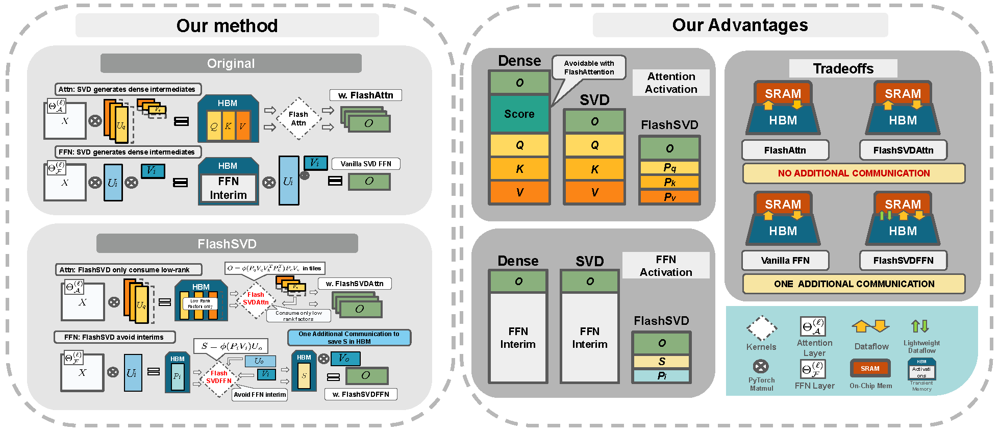
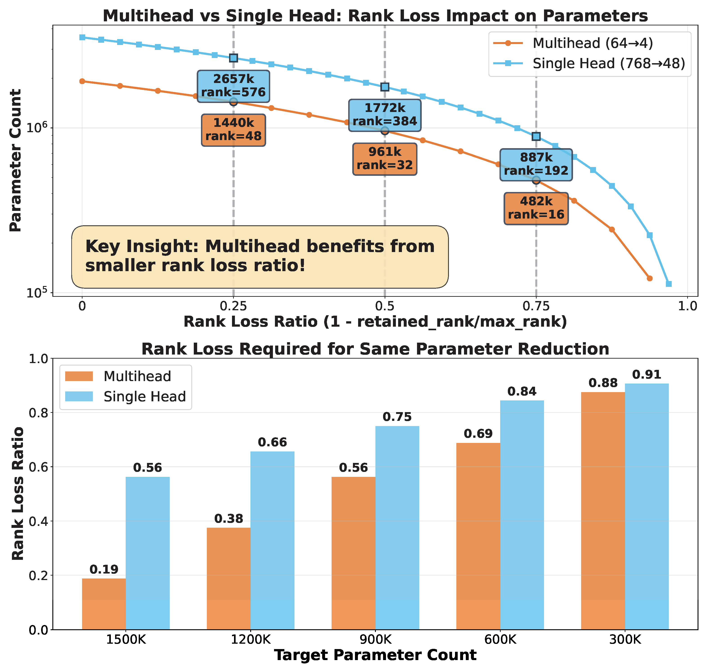

# FlashSVD: Efficient Transformer Architecture with Low-Rank Decomposition

[](https://opensource.org/licenses/MIT)
[](https://www.python.org/downloads/)

This repository contains the official implementation of **FlashSVD**, a novel end-to-end rank-aware streaming inference framework specifically designed for SVD-compressed large language models. FlashSVD addresses the critical limitation of previous SVD-based compression techniques by eliminating activation memory overhead during inference.


**Paper**: [FlashSVD: Memory-Efficient Inference with Streaming for Low-Rank Models](https://arxiv.org/abs/2508.01506)


## Overview

Singular Value Decomposition (SVD) has recently seen a surge of interest as a simple yet powerful tool for large language models (LLMs) compression, with a growing number of works demonstrating 20-80% parameter reductions at minimal accuracy loss. However, previous SVD-based approaches have focused primarily on reducing the memory footprint of model weights, largely overlooking the additional activation memory overhead incurred during inference when applying truncated factors via standard dense CUDA kernels.

Our experiments demonstrate that this activation overhead, scaling with sequence length and hidden dimension, prevents current SVD compression techniques from achieving any reduction in peak inference memory, thereby limiting their viability for real-world, on-device deployments.

### Pipeline



The figure above illustrates the FlashSVD computation pipeline, showing the efficient flow from input through low-rank attention and feed-forward layers.


### Key Contributions

We introduce **FlashSVD**, a novel, end-to-end rank-aware streaming inference framework specifically designed for SVD-compressed large language models. FlashSVD can be seamlessly integrated with any model that employs SVD-based methods for parameter reduction. By fusing low-rank projection kernels directly into both the self-attention and feed-forward network (FFN) pipelines, FlashSVD avoids materializing full-size activation buffers. Instead, small tiles of the truncated factors are loaded into on-chip SRAM, multiplied and reduced on the fly, and immediately evicted, preserving high GPU occupancy and adding no extra latency.

- **End-to-End Streaming Framework**: Rank-aware inference system for SVD-compressed models
- **Fused Low-Rank Kernels**: Direct integration into attention and FFN pipelines  
- **Tile-Based Computation**: Avoids materializing full-size activation buffers
- **Memory-Efficient Deployment**: Up to 70.2% reduction in peak activation memory

## Key Features

- **Universal Integration**: Seamlessly works with any SVD-compressed model
- **Streaming Inference**: Tile-based computation avoids activation buffer materialization
- **GPU Optimized**: Fused kernels preserve high GPU occupancy with no extra latency on medium-low ranked cases
- **Memory Efficient**: Up to 70.2% reduction in peak activation memory
- **Accuracy Preserving**: No accuracy loss with upstream compression methods

## Installation

### Prerequisites

- Python 3.8 or higher
- CUDA-compatible GPU (recommended)
- PyTorch 1.12+ with CUDA support

### Setup

1. **Clone the repository:**
   ```bash
   git clone https://github.com/yourusername/FlashSVD.git
   cd FlashSVD
   ```

2. **Install dependencies:**
   ```bash
   pip install torch torchvision torchaudio --index-url https://download.pytorch.org/whl/cu118
   pip install transformers datasets evaluate accelerate
   pip install triton 
   ```

3. **Install additional requirements:**
   ```bash
   pip install matplotlib numpy tqdm
   ```

## Quick Start

### 1. Training BERT with FlashSVD

Train BERT models with specific GLUE tasks and rank configurations:

```bash
# Train BERT on SST-2 task with custom ranks
python train_bert.py --task sst2 --mode cls --epochs 3 --bsz 32

# Train BERT on QNLI task
python train_bert.py --task qnli --mode cls --epochs 3 --bsz 32

# Train BERT on RTE task
python train_bert.py --task rte --mode cls --epochs 3 --bsz 32

# Train RoBERTa models
python train_roberta.py
python train_roberta_large.py
```

### 2. Inference and Profiling

After training, run inference with profiling in the BERT/BERTFW directories:

```bash
# Navigate to BERT directory for standard inference
cd BERT/
python profile_flashsvd.py  # or your specific profiling script

# Navigate to BERTFW directory for FlashSVD inference
cd BERTFW/
python profile_flashfwsvd.py  # or your specific profiling script
```

The profiling scripts will provide detailed performance metrics including:
- Inference latency
- Memory usage
- Comparison between standard and FlashSVD implementations


## Results

### Performance Comparison

FlashSVD achieves significant improvements in efficiency:

- **Memory Reduction**: Up to 70.2% reduction in peak activation memory
- **Intermediate Memory**: 75% reduction in transient memory usage
- **Accuracy Preservation**: No accuracy loss with upstream compression methods
- **Practical Deployment**: Enables memory-constrained deployment of low-rank LLMs

### Rank Loss Analysis



The figure above shows the trade-off between rank reduction and model performance across different tasks.

### Key Contributions

Our work addresses the critical limitation of previous SVD-based approaches by introducing:

- **End-to-end rank-aware streaming inference framework**
- **Fused low-rank projection kernels** for both attention and FFN
- **Tile-based computation** that avoids materializing full-size activation buffers
- **Seamless integration** with any SVD-compressed model

## Citation

If you find this work useful in your research, please cite our paper:

```bibtex
@article{shao2025flashsvd,
  title={FlashSVD: Memory-Efficient Inference with Streaming for Low-Rank Models},
  author={Shao, Zishan and Wang, Yixiao and Wang, Qinsi and Jiang, Ting and Du, Zhixu and Ye, Hancheng and Zhuo, Danyang and Chen, Yiran and Li, Hai},
  journal={arXiv preprint arXiv:2508.01506},
  year={2025}
}
```

<!-- **Paper**: [FlashSVD: Memory-Efficient Inference with Streaming for Low-Rank Models](https://arxiv.org/abs/2508.01506) -->

## Project Structure

```
FlashSVD/
├── src/                    # Core implementation
│   ├── kernels/           # CUDA kernels and optimizations
│   └── utils/             # Utility functions and blocks
├── models/                # Pre-trained model checkpoints
│   ├── BERT/             # BERT model variants
│   └── RoBERTa/          # RoBERTa model variants
├── benchmark/             # Performance evaluation scripts
├── figs/                  # Paper figures and diagrams
├── train_*.py            # Training scripts for different models
└── README.md             # This file
```

## Contributing

We welcome contributions! Please feel free to submit issues and pull requests.

**Note**: This implementation is based on research work. For questions or issues, please open an issue on GitHub.
