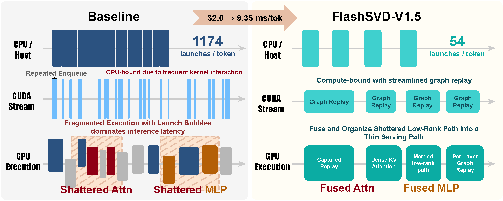

# FlashSVD v1.5: Making Low-Rank Transformers Inference Actually Fast

FlashSVD is a streaming inference runtime for SVD-compressed language models.
This repository now treats **FlashSVD v1.5** as the primary product path.

The main runtime code stays in the existing top-level directories such as
`models/`, `runtime/`, and `utils/`. The lightweight v1.5 demo entrypoint
is [demo_flashsvd_v15.py](demo_flashsvd_v15.py), with helper code under
`scripts/demo_support/`.



Quick links:

- Demo: [one-command run](#demo)
- Status: [current serving direction](docs/notes/CURRENT_STATUS.md)
- Layout: [architecture notes](docs/architecture.md)
- Benchmarks: [decode benchmark entrypoint](benchmark/decode/bench_flashsvd_vs_svd_decode.py)

## Main Layout

```text
demo_flashsvd_v15.py  root-level v1.5 demo entrypoint
models/               Hugging Face-facing model integration
runtime/              decode dispatch, cache plumbing, backend selection
kernels/              Triton / kernel implementations
src/                  compression and conversion flows such as SVD-LLM
utils/                loading, evaluation, checkpoint utilities
benchmark/            benchmark and correctness scripts for v1.5
scripts/              demo support helpers, job scripts, and smoke tests
docs/                 repository architecture notes
```

More detail: [docs/architecture.md](docs/architecture.md)

## Current Serving Direction

The production decode path follows the v1.5 runtime described in
[docs/notes/CURRENT_STATUS.md](docs/notes/CURRENT_STATUS.md):

- attention: dense KV cache + reconstruct current token + `flash_attn_with_kvcache`
- MLP: `auto` with graph-enabled routing to the packed production path

The verified notes in that file were last checked on March 10-11, 2026 and
report about `1.50x` to `1.53x` end-to-end decode speedup on the documented
Llama-2-7B configuration.

## Installation

FlashSVD v1.5 requires Python `3.10+` and a CUDA/PyTorch environment if you
want to run the fused GPU path.

Recommended environment bootstrap:

```bash
git clone https://github.com/anonymous-review/FlashSVD.git
cd FlashSVD
conda env create -f environment.yml
conda activate flashsvdv15
pip install -e .[test]
```

If you already manage your own CUDA stack, the repository dependencies are:

```bash
# install the pinned runtime stack used by this repo
pip install -r requirements.txt

# optional: install repo extras such as pytest
pip install -e .[test]
```

The demo helpers are repo-local and live under `scripts/demo_support/`; they do
not require a separate top-level package layout. If you need a different
PyTorch/FlashAttention build, install that first and then install the repo
dependencies.

## Quick Start

### Python API

```python
from scripts.demo_support import (
    cast_model_for_inference,
    configure_runtime,
    generate_text,
    get_model_from_source,
)

configure_runtime(
    mode="flashsvd",
    ffn_backend="auto",
    enable_mlp_graph=True,
    mlp_graph_scope="layer_tail",
    enable_flash_dense_attn=True,
)

model, tokenizer = get_model_from_source("/path/to/checkpoint-or-hf-export")
model = cast_model_for_inference(model, dtype="auto", device="cuda")

result = generate_text(
    model,
    tokenizer,
    prompt="FlashSVD accelerates low-rank language models by",
    max_new_tokens=64,
    device="cuda",
)
print(result["completion_text"])
```

### Demo

From the repository root, the following copy-paste command runs the FlashSVD
v1.5 demo checkpoint end to end:

```bash
export FLASHSVD_REVIEW_ARTIFACT_REPO_ID="<hf-namespace>/<hf-repo>"

CUDA_VISIBLE_DEVICES=0 python demo_flashsvd_v15.py \
  --checkpoint ReviewArtifacts::llama_7b/Basis_Sharing/share_llama-7b_20 \
  --device cuda \
  --dtype auto \
  --prompt "Explain in one sentence: FlashSVD accelerates low-rank language models by" \
  --max-new-tokens 24 \
  --warmup-tokens 16
```

If you already have the `flashsvdv15` environment from the installation step
active, that command should run directly without any local checkpoint
preparation after `FLASHSVD_REVIEW_ARTIFACT_REPO_ID` points at the review or
artifact Hugging Face mirror. The `ReviewArtifacts::...` prefix is an anonymous
alias for review builds; it loads the `Basis Sharing 0.8` LLaMA-7B export,
which is not the fastest public example but is a much better first-run demo
checkpoint than the `SVD-LLM v1 update 0.5` export.

This configures the current FlashSVD v1.5 serving recipe:

- dense-KV decode enabled
- `auto` FFN backend
- MLP CUDA graph enabled with `layer_tail` scope

The demo now prints both a `cold` speed and a `steady_state` speed. The first
includes one-time costs such as dense-decode autotuning and CUDA graph capture;
the second reruns the same prompt after those caches are populated and is the
better quick sanity-check number. You can add `--warmup-tokens N` if you want
an extra untimed warmup pass between those two measurements.

If you want to compare against the fallback path with the same prompt and token
count, rerun the same command with `--mode hf`.

### Benchmarks

Headline decode benchmark:

```bash
python benchmark/decode/bench_flashsvd_vs_svd_decode.py \
  --checkpoint /path/to/checkpoint.pt \
  --dtype bf16 \
  --device cuda \
  --prompt_len 512 \
  --new_tokens 32 \
  --warmup 3 \
  --batch_size 1 \
  --flashsvd_ffn_backend auto \
  --experimental_flash_dense_attn \
  --mlp_graph \
  --mlp_graph_scope layer_tail \
  --baseline_dense_kvcache
```

Correctness check:

```bash
python benchmark/decode/check_flashsvd_decode_correctness.py \
  --checkpoint /path/to/checkpoint.pt \
  --dtype bf16 \
  --device cuda \
  --batch_size 1 \
  --decode_steps 16 \
  --legacy_backend flashsvd_mlp_dual_split_exact_legacy \
  --test_backend flashsvd_mlp_dual_split_prod \
  --flash_dense_attn \
  --baseline_dense_kvcache \
  --reference_dense_attn
```

## Compatibility

Legacy imports such as `component.*`, `flashsvd_component.*`, `models.*`,
`runtime.*`, and `utils.*` are still supported so local checkpoints and older
scripts continue to load.
